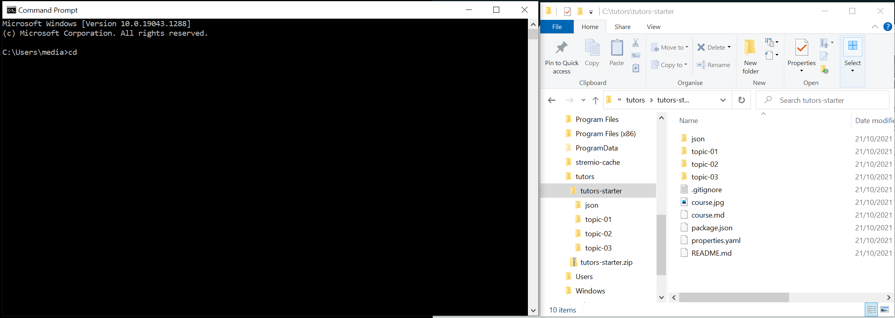
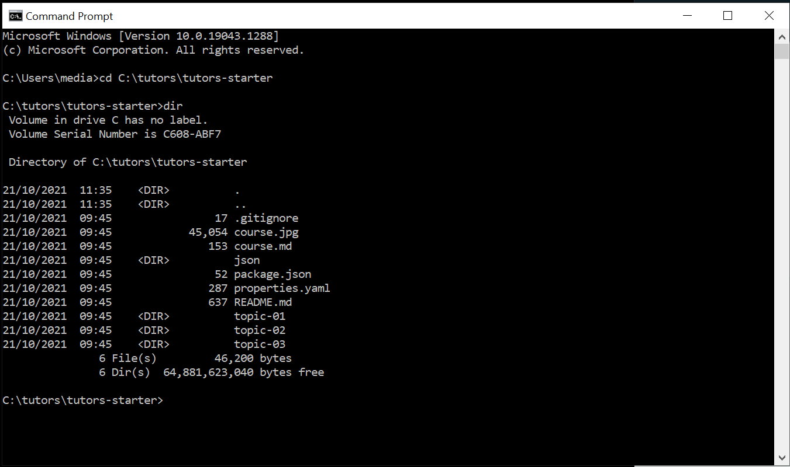
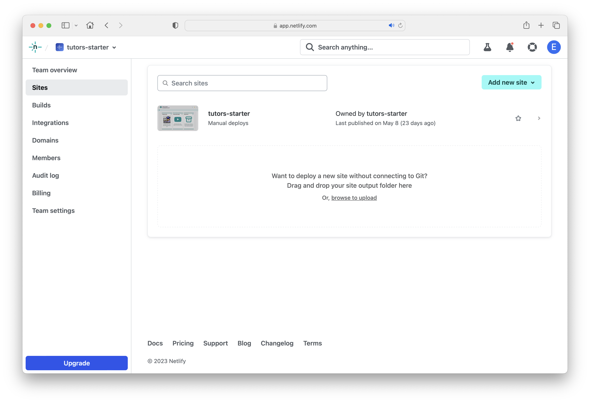
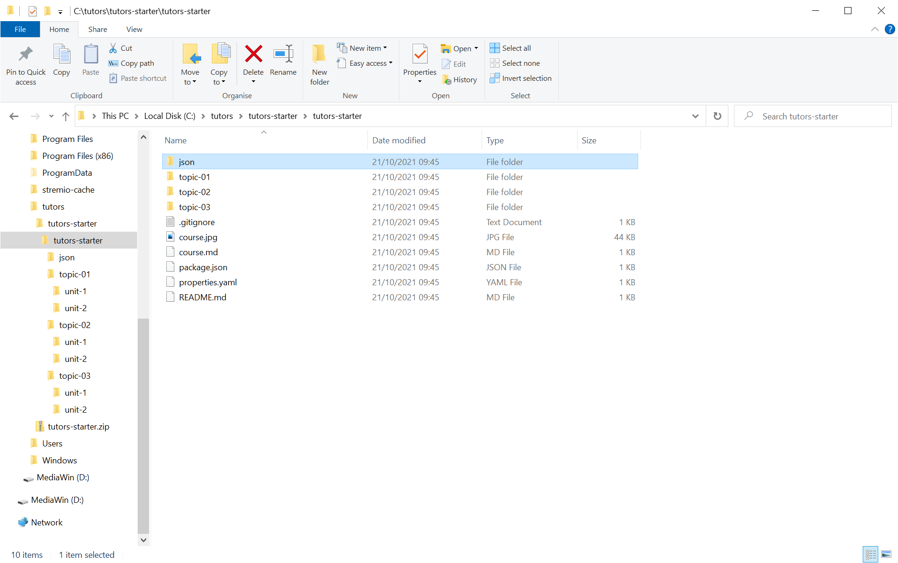
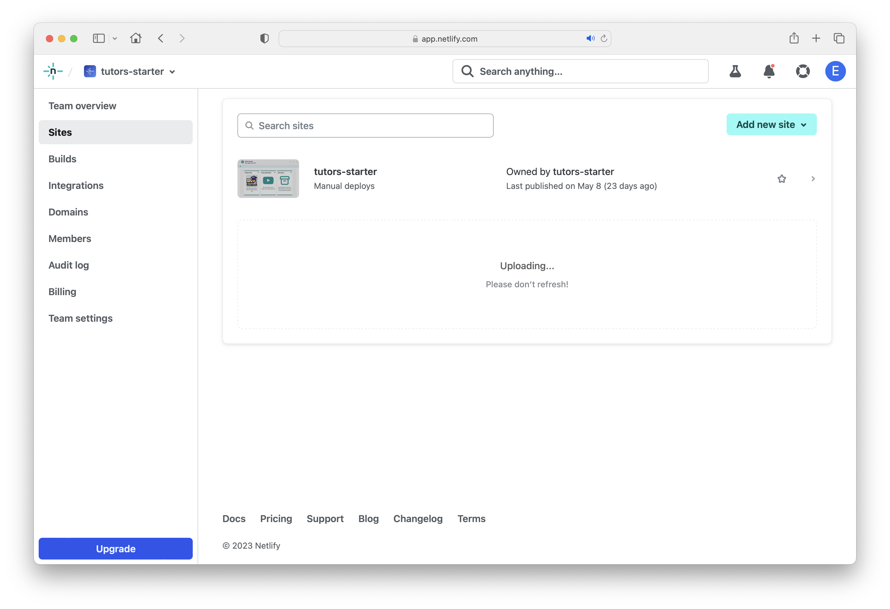
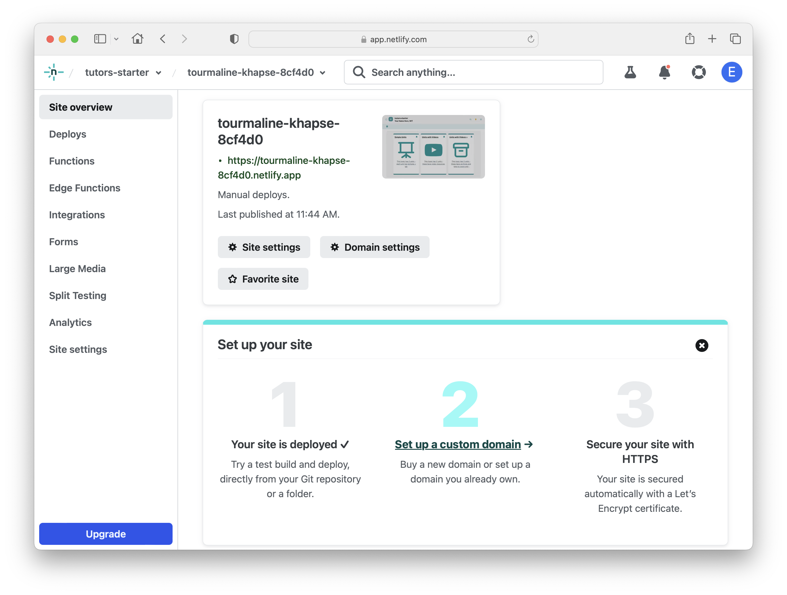
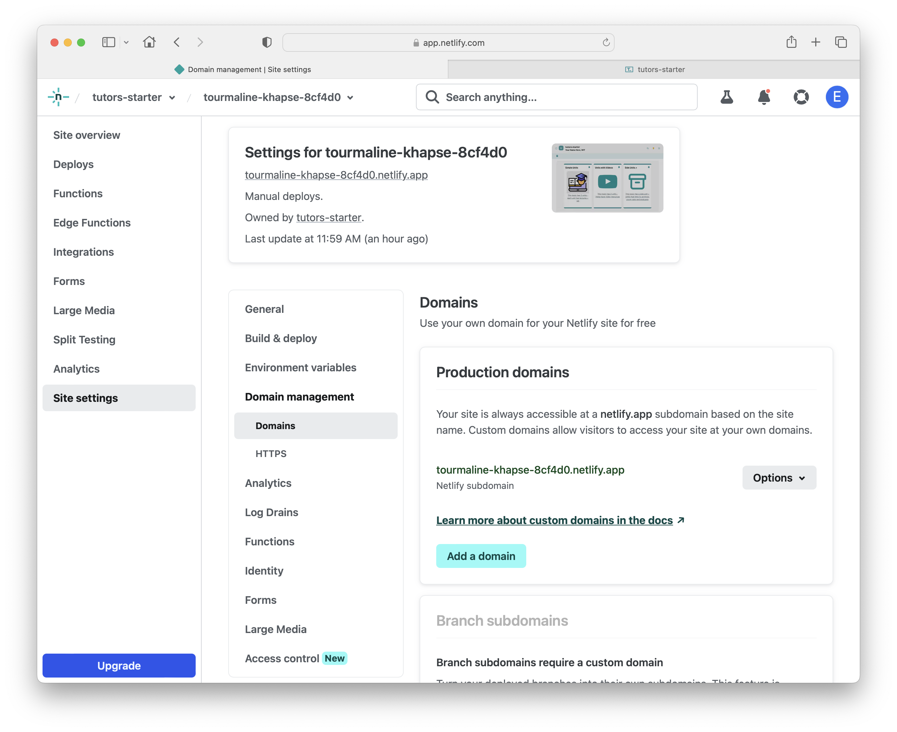
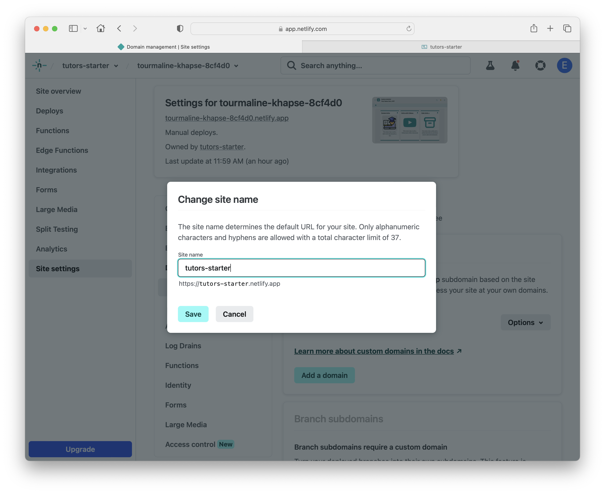
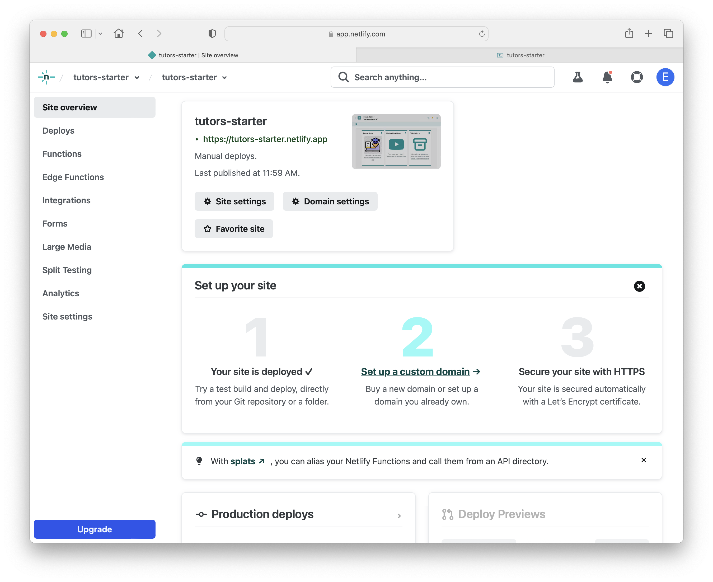

# Publish a Course

To pusblish a course, you ned to do the following:

-  `compile` the course (regenerate it). The `compile` process produces a new version of the  `JSON` folder located within the `tutors-starter` folder. 
-  drag and drop the newly generated folder `JSON` folder to the Netlify drop area for your published site as in the previous step.  

We can do this is 5 stages:

1. Open A Shell/Terminal in the course folder
2. Generate the course
3. Publish the Course
4. Visit the Published Course
5. Change the Domain Name

### 1: Open a Shell at the Course Folder

First, open a Command Prompt (or Terminal on Mac). Side by side open the folder where your course is located:

In the Command Prompt, type:

~~~
cd 
~~~

... make sure to leave a space at the end:

Now drag & drop the `tutors-starter` folder from the Finder window onto the command prompt:

This will insert the full path of the folder (see above). Press `Return or Enter` now, and then type:

 ~~~
dir
 ~~~

Your Command prompt window should look as above - you have changed into the `tutors-course` folder, and this is verified by entering the `dir` command.

## 2: Generate the Course

To compile the course, enter the following and press return:

~~~
npx tutors-publish
~~~

You should see the above after a few minutes. This is a list of the course contents. The `JSON` directory will have been updated to the latest version.

## 3: Publish the Course

To publish the course to the web, you will need to create an account on Netlify:

- <https://www.netlify.com/>

Once you create an account and log in, you should see a page something like this:

Select "Sites" :

To deploy a course, you drag & drop the `json` folder on to the drop target above:

Drag and drop this folder directly onto the drop area. This panel will display "Uploading":

Once uploaded - the page will update:

Switch to `Site Overview`:

## 4: Inspect the Published Site

The link (under the funny generated name), should now take you to the published course:

This is your copy of the sample course - independent of any other version, and it is now available globally via the link.

## 5: Change the Domain Name

This link is not very friendly so we should change it. Navigate back to Netlify `Site Overview` and select the `Domain settings`:

then scroll down to the `Custom Domains` section and click the Dropdown `Options` button and select `Edit site name`.

Enter the desired domain name for your Tutors site and click `Save`.

The name must be unique globally - so the above name will not work as-is, so append your initials, the date, or wháatever scheme makes sense.

Return to the `Site Overview` page where you will notice the link to your site has changed.

