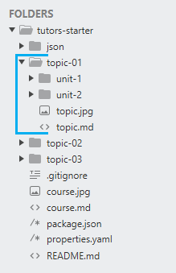
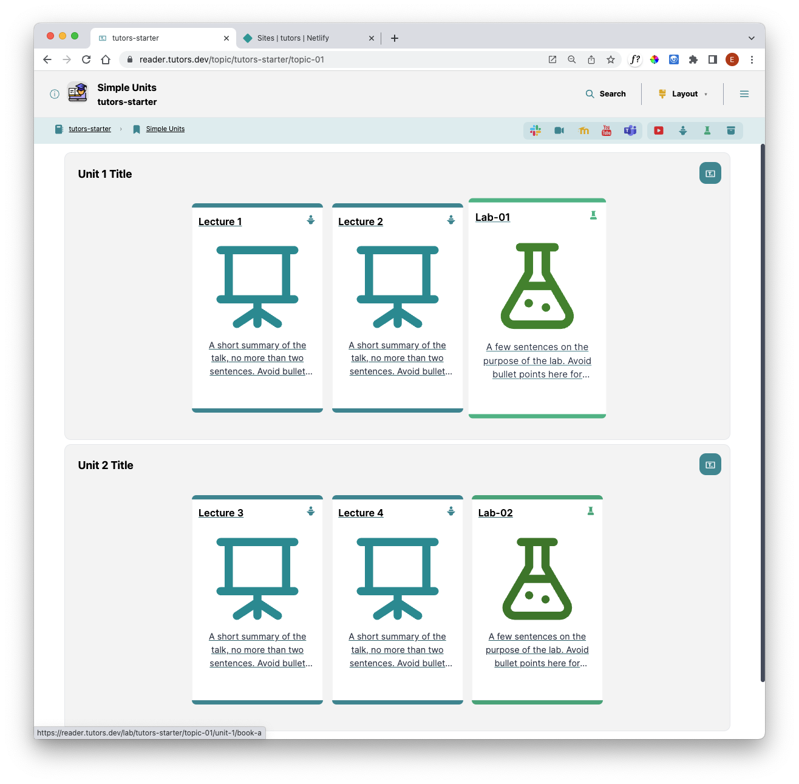

# Topics & Units

The template Tutors course `tutors-starter` which you downloaded in the first lab follows a particular file structure. Your course is formatted and organised within this folder.

## JSON

This folder is automatically generated when the command `npx tutors-publish` is run from the tutors-starter directory. The contents of this file are used by Netlify to build and deploy your Tutors site. This will be elaborated on in later steps.

**Note**: If you are experimenting with the file structure and the `npx tutors-publish` command is not applying changes correctly, just delete this folder and run the command again!

##  topic-**

Each topic folder represents a topic within a module, much like a chapter of a book. Each topic will be represented as a card on the course web:

The cards above are generated from  `topic-01`, `topic-02`, and `topic-03` elements in the course.

You can create more topic folders by copying/pasting an existing one, just be sure to follow the naming convention `topic-**`, replacing the "\*" with digits.

## unit-*

**Units** split each topic further enabling you to organise cards into groups and put a title on them.

They allow for a clear definition of course content in each unit, and for separate titles for each unit.  This is the layout of the `topic-01`:

You can see it contains 2 units.

You can create more unit folders by copying/pasting an existing one, just be sure to follow the naming convention `unit-*`, replacing the "\*" with a digit.