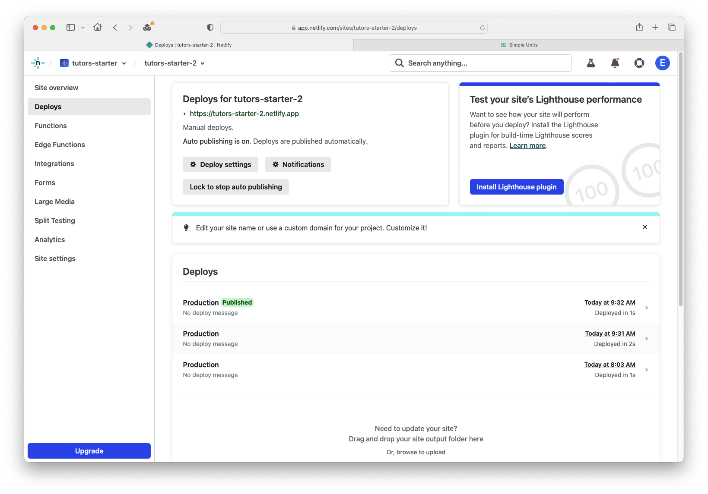

# Adding a talk

We are going to add a talk to Unit 1 within `topic-01.`

Let's revisit the file structure. In Unit 1 we currently have two talks and a lab. 

##1. Duplicate an existing talk and rename it

The easiest way to add another talk card is duplicate an existing talk.

#### Windows Users:

Right-click on `talk-1` and click `Copy.` Then

Right-click on `unit-1` and click `Paste`. 

#### Mac Users:

Right-click on `talk-1` and selct `Duplicate` instead. 

### Rename

This adds another folder called `talk-1-copy.` 
We can rename this folder to `talk-3`. 

##2. Edit the Card Title 
Edit the markdown file (.md) to change the card title with the text for your new title. 

##3. Change the Card Image

### Different icon from library
You can change the icon (as we did when creating the initial course using **Iconify**)

### Different image file supplied
But maybe you would rather use your own image or icon?

> NOTE:
> Card Images & Icons should ideally be square. 
> If rectangle card images need to be used, use 16:9 aspect ratio (wide).
> Don't use tall images e.g. 9:16

becomes

Find your image and download it. For this lab you can use the picture below. (Right-Click the image and select `download image`)

Place the image you downloaded into the `talk-3` folder. Delete the current `talk-2.jpg` file and rename the new image `talk-2.png`. 

##4. Edit the Card pdf
We can also change the `.pdf` to the content we want to be displayed. This action can be used to add more labs and units also. 

##5. Republish
Save the file and recompile it by typing `npx tutors-publish` into the terminal. 

Drag and drop the newly generated JSON folder to the Netlify drop area for your published site. 

Check if the changes you made are on the live site.

## FILE NAMES

> NOTE:
> Within the **talk folder**, 
> 
> All 3 files in the talk folder (.md, .png/.jpg, .pdf) must have the same name
> 
> e.g. folder `talk-3` might have the following files
> 
> - talk.md
> - talk.png
> - talk.pdf
> 
> you can rename files to suit
