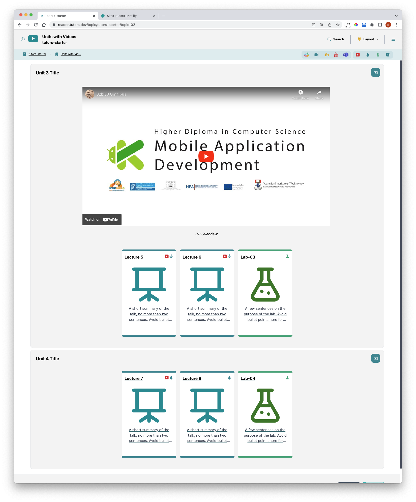
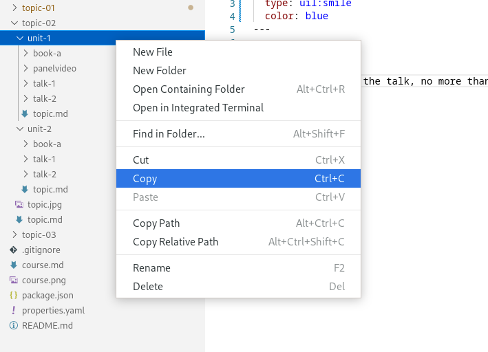
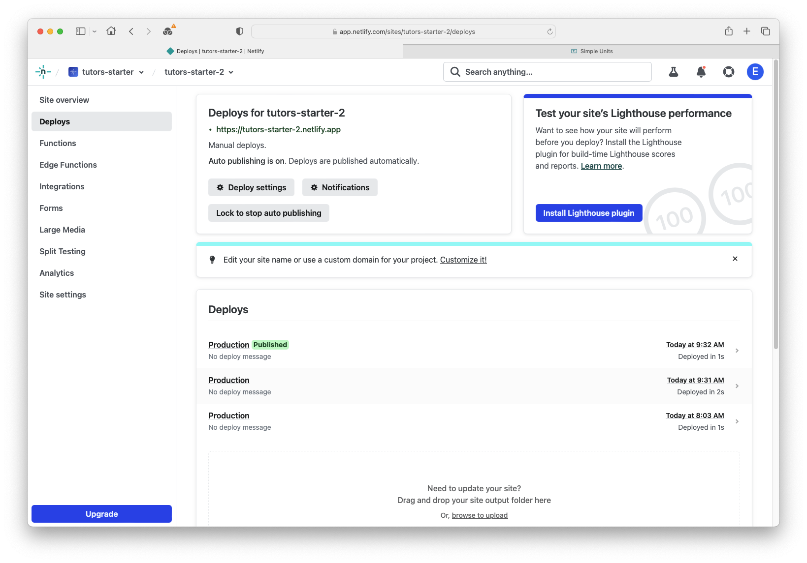

# Adding a unit

## Introduction

We are going to add another unit to our course. 

This time we are going to edit `topic-02`, the `Units with Videos` card. 

In this topic we already have 2 units.

The two units we currently have are different: 

- the first unit has a **panel video** and 3 cards
- the second unit is a **regular unit** (no video) with 3 cards. 

##Duplicating an existing unit

The easiest way to add another unit is to duplicate it. 

Choose which unit to copy. 

Right-click on the chosen unit and click `Copy.`

Right-click on `topic-2` and click `Paste`. This adds in another folder called `unit-1-copy`. We can rename this folder to `unit-3`. 

Note you can add or remove cards from this unit by duplicating or deleting the folders as desired.

##Edit the new unit

Now edit the markdown file (.md).

Change the content to what you want to be displayed within this unit. i.e. the unit heading

##Republish

Save the file and recompile it by typing `npx tutors-publish` into the terminal. 

Drag and drop the newly generated JSON folder to the Netlify drop area for your published site. 

Check if the changes you made are on the live site.
