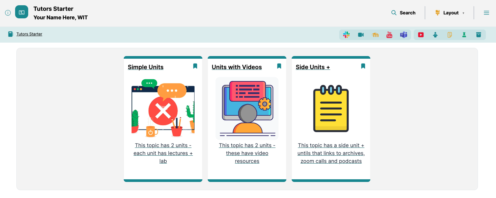
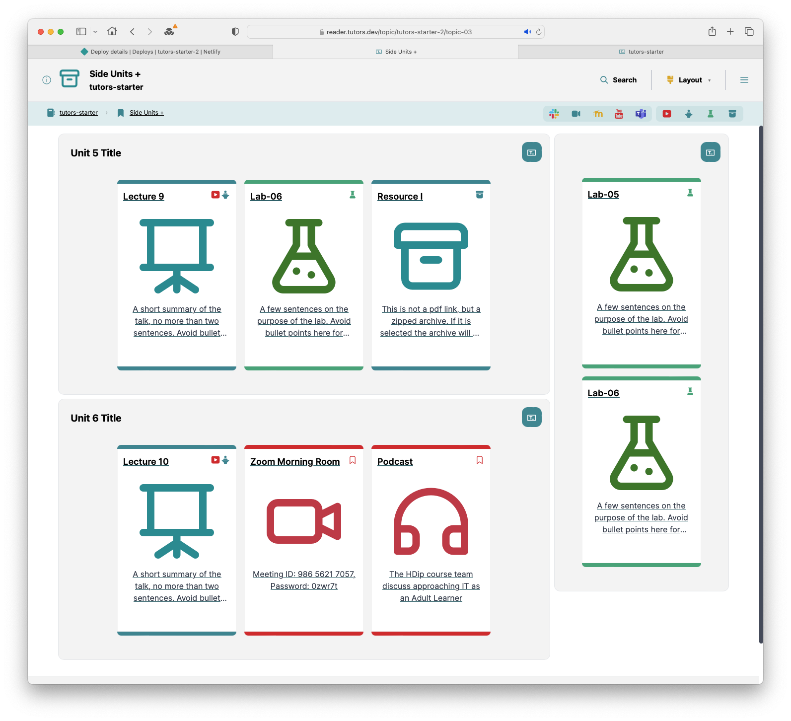
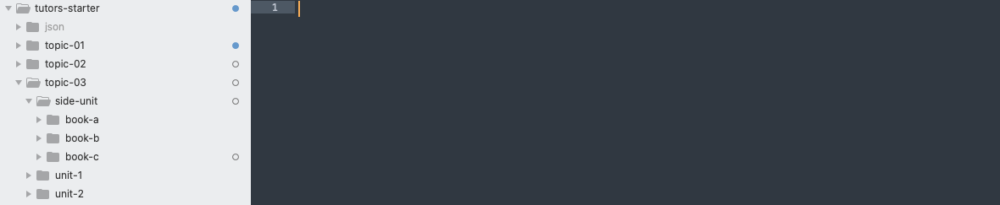
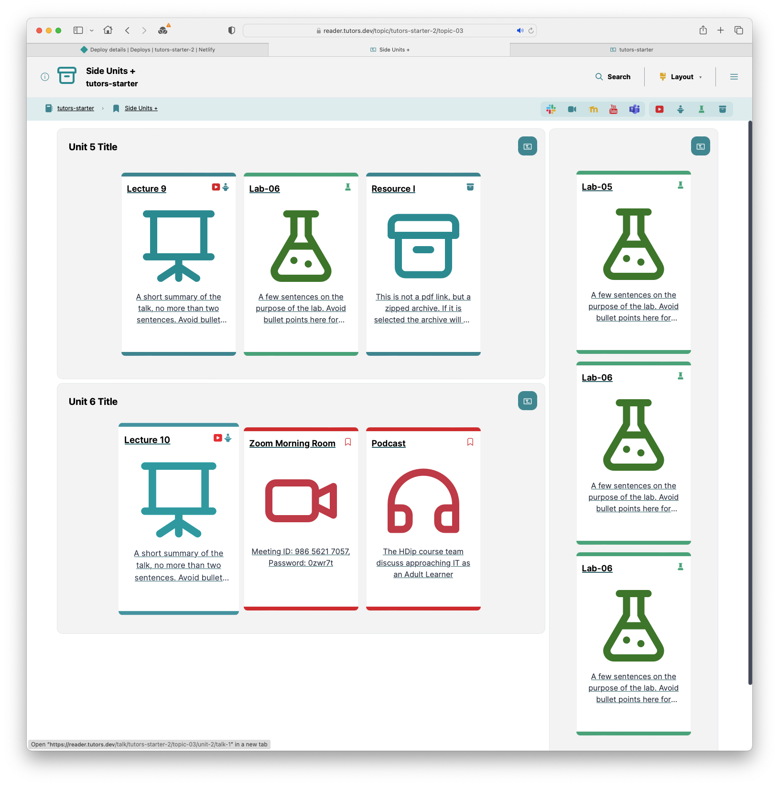

# Adding a lab (to a side unit)

We are going to add another lab to our course. 

Let's view the course first.

This time, we will add a **lab** to the **side unit** for **topic-3**. 

We will be editing `topic-03` in our course which defines what is displayed when the `Side Units +` card/topic is opened.

Let's click on the `Side Units +`card. 

Note there are 2 labs in this Side Unit already.

##How To
In the course folder, locate the `topic-03` folder. Inside this locate the `side-unit` folder 

Inside the `side-unit` folder, duplicate the book-b folder, calling it book-c

Proceed to rebuild & publish:

- `npx tutors-publish`
- Drag/drop `json` folder to Netlify
- Open the published course:

Note there are now 3 labs in this Side Unit. We just added the third.