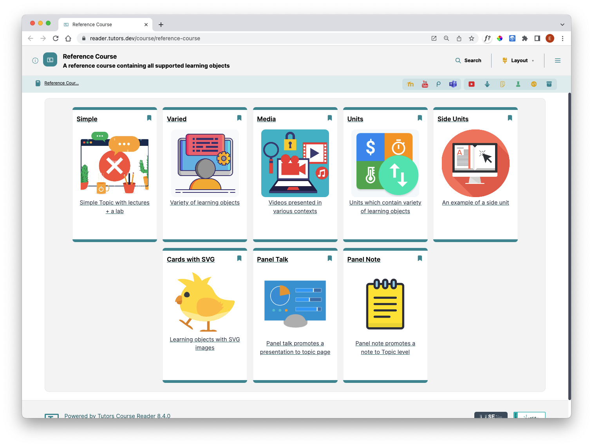
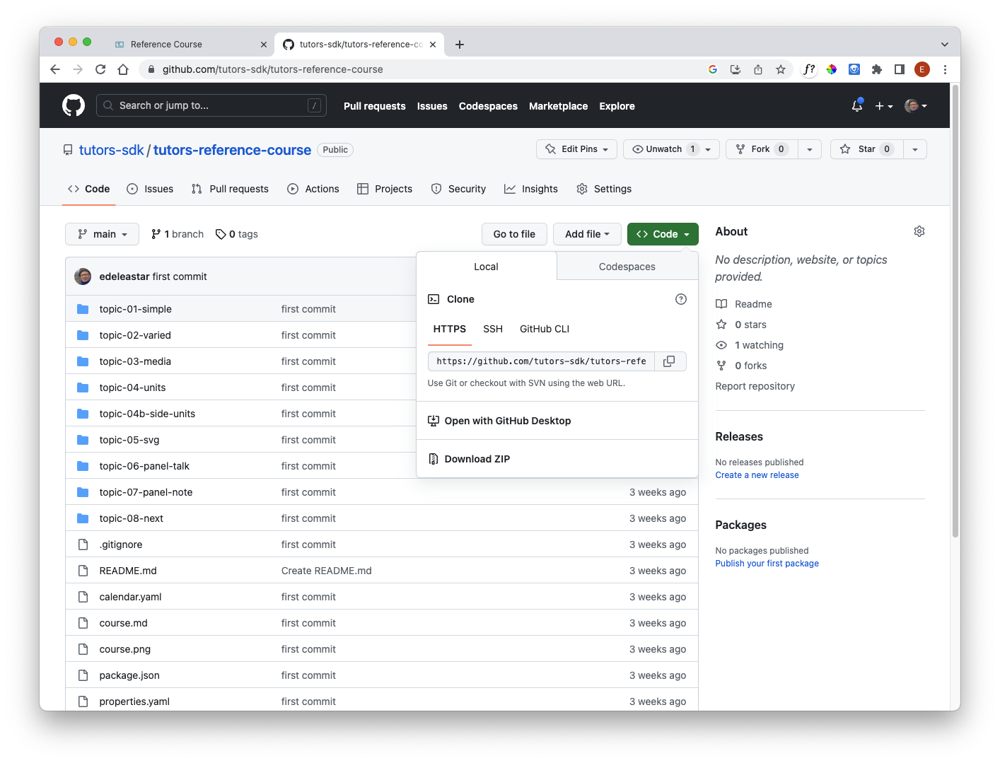

#Exploring Tutors further

Our quick tour until now has shown just some aspects of a tutors course. There are many more to explore yourself. 

We've provided a reference course called *The Kitchen Sink* which allows you to try out different features and examine how they are implemented.

Hopefully, we will eventually get round to documenting them properly! Until then, it's a good idea to bookmark the course, and how a copy downloaded, so you can work out what you need in your next tutors course.

##Kitchen Sink

###Kitchen Sink - explore
<https://reader.tutors.dev/course/reference-course>

This is a more complete course than the example we have been exploring. Inspect each of the topics and explore the varieties of potential learning objects.

###Kitchen Sink - download
Download the source of this course from here:

- <https://github.com/tutors-sdk/tutors-reference-course>

To download, select `Code` and then `Download ZIP` from the dropdown.

###Kitchen Sink - deploy

You should be able to deploy this course to your own Netlify account now.