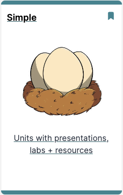
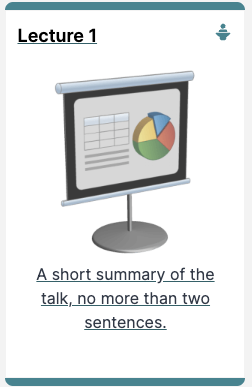

---
order:4
---
Tutors CheatSheet v2.0

Tutors quick reference

[toc]

## Course Folders

Folders starting with the following names have a significance in Tutors:

| Folder Name | Description |
| ----------- | ----------- |
| topic       |  Top level course topic  |
| unit        |  Group of learning objects within a topic           |
| side    |  Group of learning objects framed in a sidebar  |
| archive     | Downloadable zip file of resources |
| book        | Step by step lab instructions, authored in markdown |
| github      | Link to a GitHub repository |
| note        | Single web page, authored in markdown |
| panelvideo  | A full screen width video, hosted in YouTube or HEANet |
| paneltalk   | Full screen width  presentation in pdf format |
| panelnote   | Full screen width note |
| talk        | Standard presentation in pdf format |
| web         | Link to an external web site |

The following filenames are significant:

| File namr | Description |
| ----------- | ----------- |
| weburl      |  link to external web site  |
| videoid      |  id of  external video  |
| githubid     |  link to github repo  |

For all file & folder names, avoid spaces within a file name. So instead of:

- Topic Introduction

...use:

- topic-introduction

## Course Structure

The minimum requirements for a course are a folder containing these three files:

- course.md
- course.png
- properies.yaml

### course.md

A markdown file, structured as follows:

~~~markdown
Course Title

Course information - a course outline, description or any other information. Can be any length. Will appear as slide over if the user presser the Info button on the top left.
~~~

### course.png

An image that will be used in the course title bar

### properties.yaml

Course metadata in yaml format. At a minimum, this must contain the following:

~~~yaml
credits: The course author(s) or organisation
~~~

The credits property will appear as a subtitle in the course title bar.

There are a range of other optional properties. See the end of this document for a complete list.

### Folder Structure

A course typically consists of a series of topic folders, named to sort alphabetically: 

| Folder Name            |
| ---------------------- |
| topic-01-introduction  |
| topic-02-learning-html |
| topic-03-learning-css  |

## Topic

A topic will appear on the course page as a card:

The title, subtitle and image are drawn from 2 files:

### topic.md

~~~~markdown
# Simple

Units with presentations, labs + resources
~~~~

### topic.png

## Learning Resources

### Types

Tutors supports nine types learning resources: 

- archive
- book
- github
- note
- panelvideo
- paneltalk
- panelnote
- talk
- web

Each learning resource is contained within a folder, whose name starts with the name above, and may continue with additional sorting & semantic information. Eg:

- talk-1-intro
- talk-2-explore

The numerals imply alphabetic sorting of these 2 learning resources.

### File Structure

Each resource much have the following files:

- some-resource-name.md
- some-resource-name.png

The name chosen for the markdown file must be also used for the .png. These provide essential information to populate a tutors card. For example this card:

would require these two files:

#### introduction.md

~~~markdown
Lecture 1

A short summary of the talk, no more than two sentences.
~~~

#### introduction.png

## Talk

A talk is a PDF presentation, document or other pdf based resource. 

## Image resizing

- <https://nodeca.github.io/pica/demo>

  
