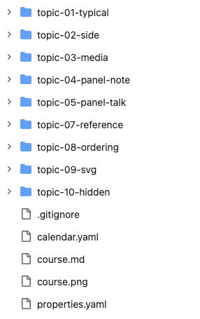

---
order:4
---
Tutors CheatSheet v2.0

Tutors quick reference

[toc]

## Semantic Naming & Ordering

Folders starting with the following names have a significance in Tutors:

- topic
- unit
- side
- archive
- book
- github
- note
- panelvideo
- paneltalk
- panelnote
- talk
- web

The following filenames are significant:

- githubid
- videoid

For all file & folder names, avoid spaces within a file name. So instead of:

- topic Introduction

...use:

- topic-introduction

To sort folders, use numerals to achieve alphabetic sorting:

- topic-01-introduction
- topic-02-learning-html
- topic-03-learning-css

## Course Structure

The minimum requirements for a course are a folder containing these three files:

- course.md
- course.png
- properies.yaml

### course.md

A markdown file, structured as follows:

~~~markdown
Course Title

Course information - a course outline, description or any other information. Can be any length. Will appear as slide over if the user presser the Info button on the top left.
~~~

### course.png

An image that will be used in the course title bar

### properties.yaml

Course metadata in yaml format. At a minimum, this must contain the following:

~~~yaml
credits: The course author(s) or organisation
~~~

The credits property will appear as a subtitle in the course title bar.

There are a range of other optional properties. See the end of this document for a complete list.

### Folder Structure

 A course typically consists of a series of topic folders, named to sort alphabetically: 

- 

Each topic folder 

## Learning Resources

### Types

Tutors supports nine types learning resources: 

- archive
- book
- github
- note
- panelvideo
- paneltalk
- panelnote
- talk
- web

Each learning resource is contained within a folder, whose name starts with the name above, and may continue with additional sorting & semantic information. Eg:

- talk-1-intro
- talk-2-explore

The numerals imply alphabetic sorting of these 2 learning resources.

### Structure

Each resource much have the following files:

- some-resource-name.md
- some-resource-name.png

The name chosen for the markdown file must be also used for the .png. These provide essential information to populate a tutors card. For example this card:


would require these two files:

#### introduction.md

~~~markdown
Lecture 1

A short summary of the talk, no more than two sentences.
~~~

#### introduction.png


## Talk

A talk is a PDF presentation, document or other pdf based resource. 


Images

- <https://nodeca.github.io/pica/demo>

  

##Learning Resources


###a) Card Images

in all the examples below, the image displayed on the card works as follows

you can use the icon code with the ICONIFY library
(remove the image files if using icon code)


OR

supply a .png or .jpeg image. (remove the icon code if supplying image files)


> NOTE:
> Card Images & Icons should ideally be square. 
> If rectangle card images need to be used, use 16:9 aspect ratio (wide).
> Don't use tall images e.g. 9:16


###b) Ordering
Cards are ordered automatically within a topic / unit.
You can control the ordering manually by including code similar to the following in the .MD file for your card/learning resource

```
---
order: 1
---
```

This approach can be combined with icons for all learning resources except labs


```
---
order: 1
icon:
  type: heroicons-outline:book-open
  color: red
---   
```

Known Problem/Workaround:

For now, to order the labs use this approach in the 00 step of the lab

```
---
icon:
  type: heroicons-outline:book-open
  color: red
---  
order: 1
---   
```

###c) File Names

Don't use spaces in filenames. Use a hyphen (-) instead.

> NOTE:
> Within a learning resource **folder**, 
> 
> All (3) files in the folder (e.g. .md, .png/.jpg, .pdf) must have the same name
> 
> e.g. folder `talk-1` might have the following files
> 
> - talk.md
> - talk.png
> - talk.pdf
> 
> you can rename files to suit


###d) Folder/File Names
These no longer need to be the same.

Folder names are expected to start with certain keywords and use numbers. However, they can be extended to indicate what's in them

The files within the folder just need to all be the same name with exceptions bolded below

Don't use spaces in foldernames. Use a hyphen (-) instead. e.g. side-unit

## 1. Presentation / Talk / Lecture / Slides

Folder is called `talk-1`

Files inside:

-	talk.md
-	talk.pdf
-	talk.png

### FILE NAMES

> NOTE:
> Within the **talk folder**, 
> 
> All 3 files in the talk folder (.md, .png/.jpg, .pdf) must have the same name
> 
> e.g. folder `talk-1` might have the following files
> 
> - talk.md
> - talk.png
> - talk.pdf
> 
> you can rename files to suit


## 2. Lab 

### 2.1 Lab Steps

Folder is called `book-a`

Sub Folders

- `/archive`
- `/img`

**Steps** are in a separate `.md` documents stored within the book folder. e.g.

```
book-1/

- 01.analyse.md
- 02.design.md
- 03.implement.md
- 04.test.md
- 05.deploy.md
```


**Solutions** are archived into the archive sub folder

- `/archive/lab6-solutions.zip`

**Images** for the lab are stored in the img sub folder

- `/img/1.png`


### 2.2 Autonumbered Lab Steps

To use autonumbered lab steps, edit `properties.yaml` in the root folder for the course as follows

```
labStepsAutoNumber: true 
```

```
book-2/

- 01.01.md
- 02.02.md
- 03.03.md
```

Here the first two digits are for ordering on the page (and in the folder listing)

The second two digits are the **'short title'**

The first line in the actual md file is taken as the **'long title'**. This is displayed in the sidebar

### 2.3 Lab Titles & Names

For more details on Lab file names and titles and how they control the output displayed in breadcrumbs and on lab pages see [Labs II](https://reader.tutors.dev/lab/tutors-docs/unit-3-edit/book-d-labs/Lab%20Names)

##3. Archive / Resources

Used to store a zip file on a card which downloads when clicked

Use an `archive-1` folder

Files inside:

-	archive.md
-	archive.png
-	**archive.zip**


##4. GitHub Repo

Used to reference a github repo on a card directly

Use a `github-1` folder

Files inside:

-	github.md
-	github.png
-	**githubid**


##5. WebLink

Used to reference a website / hyperlink

Use a `web-1` folder

Files inside:

-	web.md
-	web.png
- **weburl** 


##6. Note

A document written in Markdown

Use a `note-1` folder

Files inside:

-	**note.md**
-	note.png

A table of contents can be auto generated by including `[toc]` in the document where you want the table to be included.

Notes can include images and archives (similar to labs).

Sub Folders

- `/archive`
- `/img`

##7. Units and Panels


###7.1 Units
**Units** split up **topics** enabling you to organise cards into groups and put a title on them.

They allow for a clear definition of course content in each unit, and for separate titles for each unit.  

Each unit has a folder named as follows:

- `unit-1`
- `unit-2` 

Within each unit folder, include a `topic.md file` to supply the title of that unit.


###7.2 Panels

In the same way that a unit sub divides a topic with unit titles, three types of panels can be added to a unit:

1. **panelvideo**
2. **paneltalk** 	
3. **panelnote**

A subfolder with the name as one of the three panel types shown above is included in the unit folder.

In each case a `.md file` is included to put a caption underneath the panel. In the case of panel note, this is developed further as discussed within `section 6 Notes` above.

###7.2.1 Panel Video

Create a `/panelvideo-1` sub folder.

Within it, supply the following files

- panelvideo.md
- **videoid**

###7.2.2 Panel Talk

Create a `/paneltalk-1` sub folder.

Within it, supply the following files

- talk.md
- talk**.pdf**


###7.2.3 Panel Note

Create a `/panelnote-1` sub folder.

Within it, supply the following files

- **note.md**
- note.png


###7.3 Side Unit / Panels

Side units are most often used for putting labs or challenges to the side, while all content needed for the labs are included in the traditional layout.

Create a `/side-unit` sub folder.

Within it, supply the following file

- **topic.md**

- any folders for the cards you want included in the side unit. The could be any of the items described in sections 1-6 above (labs, talks, notes, weblink, github, archive)  


##8. Media / Video

Tutors supports embedding live video streams / videos from Youtube and HeaNet.

The Youtube ID or HeaNet id is included in a file called `videoid`

This file can the be added to:

- a panel
- any card (talk, lab, etc)

e.g. contents of **videoid** file 1

```
1MMnr8gRIkQ
```

you can also specify a start and end time both specified in seconds

e.g. contents of **videoid** file 2

```
1MMnr8gRIkQ?start=30&end=180
```

In the example from file 2 above, the video starts playing 30 seconds from the beginning and stops playing when it reaches 3 minutes.

It is possible to store both video ids 
e.g. contents of **videoid** file 3

```
LsY0Js2tanU
heanet=7e4f1e9afedb40d5996d0703702eaaa4
```
The first line is the YouTube ID.
The second is the HeaNet ID


##9. SVG

to be completed.


##10. Other

For more details on:

- [Course Properties & Companian Apps](https://reader.tutors.dev/lab/tutors-docs/unit-3-edit/book-d-labs/Properties.yaml)
- [Videos](https://reader.tutors.dev/lab/tutors-docs/unit-3-edit/book-b-videos)
- [Maths](https://reader.tutors.dev/lab/tutors-docs/unit-3-edit/book-d-labs/Maths) 
- [Tables](https://reader.tutors.dev/lab/tutors-docs/unit-3-edit/book-d-labs/Tables)